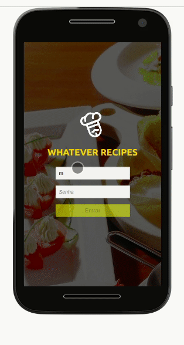

# Boas vindas ao repositório do projeto App de Receitas!

## Descrição do Projeto

Um app de receitas (projetado para mobile) onde o usuário pode interagir e aplicar diferentes tipos de buscas e filtros.

<h1 align="center">  <a href="https://vitor-m-cardoso.github.io/recipes-app/" target="_blank">🔗 Link do projeto</a>  </h1>  
🚀 #VQV

# Sumário

  <a href="#objetivos">Objetivos</a> •  <a href="#tecnologias">Tecnologias</a>  • <a href="#desenvolvedores">Desenvolvedores</a>  

 

## Demonstração da aplicação
 

 

## Objetivos
Este projeto foi criado visando desenvolver um app de receitas, utilizando duas ferramentas dentro do ecossistema React: Hooks e Redux! Neste app é possível ver, buscar, filtrar, favoritar e acompanhar o processo de preparação de receitas e drinks!

Foram utilizadas 2 APIs distintas como base de dados, linkadas abaixo, uma para comidas e a outra para bebidas.

- <a href="https://www.themealdb.com/api.php" target="_blank">Comidas</a>
- <a href="https://www.thecocktaildb.com/api.php" target="_blank">Bebidas</a>

O layout tem como foco principal os dispositivos móveis.

 

## Tecnologias

- <a href="https://pt-br.reactjs.org/docs/getting-started.html" target="_blank">React</a>
- <a href="https://reactrouter.com/web/guides/quick-start" target="_blank">React-router-dom</a>
- <a href="https://react-redux.js.org/" target="_blank">React-Redux</a>
- <a href="https://redux.js.org/" target="_blank">Redux</a>
- <a href="https://www.npmjs.com/package/redux-thunk" target="_blank">React-thunk</a>
- CSS

 

## Habilidades desenvolvidas

- Utilizar Redux para gerenciar estado;
- Utilizar a biblioteca React-Redux;
- Utilizar o React Hook useState;
- Utilizar o React Hook useContext;
- Utilizar o React Hook useEffect;
- Criar e utilizar Hooks customizados;
- Manipular informações do localStorage;
- Aprimorar as softskills desenvolvendo o projeto em grupo.

 

##  Pré-requisitos

Antes de começar, você precisará ter instalado em sua máquina as seguintes ferramentas:  
[Git](https://git-scm.com/), [Node.js](https://nodejs.org/en/).  
Além disto é bom ter um editor para trabalhar com o código como [VSCode](https://code.visualstudio.com/)

## Como rodar a aplicação

1. Clone o repositório e entre na pasta que você acabou de clonar.
  * `git clone git@github.com:vitor-m-cardoso/react-challenge-001FT.git`
  * `cd react-challenge-001FT`
2. Instale as dependências e inicialize o projeto.
  * Instale as dependências:
    * `npm install`
    * ou
    * `yarn install`
  * inicialize o projeto:
    * `npm start`
    * ou
    * `yarn start`

## Desenvolvedores

<a href="https://github.com/albertoscandido" target="_blank">**Alberto Candido**</a>
 
<a href="https://github.com/juliana-happatsch" target="_blank">**Juliana Happatsch**</a>
 
<a href="https://github.com/marialisboa600" target="_blank">**Maria Lisboa**</a>
 
<a href="https://github.com/vitor-m-cardoso" target="_blank">**Vitor Cardoso**</a>

